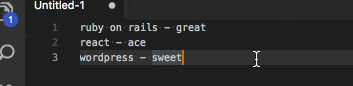
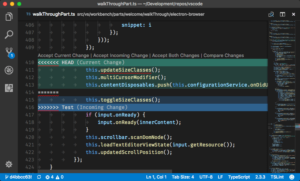

At Go Tripod, there are many ways in which we improve our working efficiency. We pick the best technologies, such as WordPress, React or Ruby on Rails. We pick the best services, such as Teamwork, Slack or Xero. But we spend our days sat in front of a computer and the way we interface with these technologies and services is just as important as how we select them.

When coding, the primary interface with code is via an editor, be that an IDE such as [WebStorm](https://www.jetbrains.com/webstorm/) or a classic editor like [vi](https://en.wikipedia.org/wiki/Vi). My current editor of choice is [Visual Studio Code](https://code.visualstudio.com/), built from the ground up by Microsoft to be a fast and extensible editor for coders. In this post I'm going to show a couple of ways in which VS Code improves my day-to-day productivity.

## Multiple Cursors

If I need to repeat something, it's going to quickly become tedious, and I'm more likely to make mistakes. How about if I can add magical automatic cursors that replicate my every keystroke?

In this GIF, I wanted to amend the hyphen to a colon. I could use find and replace, but it's also a good opportunity to try out multiple cursors. I select all lines, then press CMD+Shift+L to add cursors at the end of each line. Then I hold down Alt and move left to skip over the last word, and then begin editing the hyphens on all lines at once. Knowing the Alt-skip trick is invaluable, because it means you can move your cursors over a whole word at once and keep them aligned with punctuation over multiple lines. Without this, your cursors will become out of sync as you move over characters one-by-one.

## Git Merge Conflicts

We love [git](https://git-scm.com/), but hate resolving merge conflicts. These occur when two people have worked on the same file and the work needs to be combined, or merged, into a single version. VS Code's interface for resolving these is quick and intuitive:

As well as the UI in the editor pane that enables you to choose which change to select, the file explorer on the left on VS Code will show any files in your project with outstanding merge conflicts, and the gutter on the right-hand side of the editor will show any merge conflicts in the currently open file.

## VS Code Extensions

While VS Code isn't unique in allowing extensions, I would say that it is unique in the quantity and quality of extensions that the community has created. Language support for VS Code is detached from the editor itself, instead being supplied by extensions. This means that languages such as go, python, and rust can be written in VS Code and use editor features such as autocomplete and refactoring. Here's a selection of the extensions I have installed:

### Bookmarks

<https://github.com/alefragnani/vscode-bookmarks.git>

When I have multiple files open, I want to be able to quickly navigate between them. This extension lets me set bookmarks in a file, which I can skip back to at the press of a button.

### WordCounter

<https://github.com/Kirozen/vsce-wordcounter>

This extends the VS Code status bar to include the number of words and characters in a document or a selection.

### Prettier

<https://github.com/prettier/prettier-vscode>

Prettier is a code formatting tool which I primarily use for JavaScript and TypeScript. This extension will highlight any problems with my code formatting and even correcting it when I type or save.

## Conclusion

VS Code brings together many different features to create a tool that improves my productivity. Take a look at the full documentation on the [VS Code website](https://code.visualstudio.com/docs) and learn how to work smarter.
